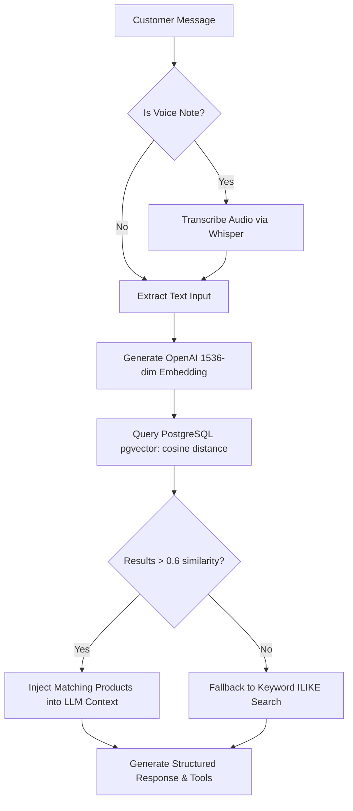

# AI Sales Agent & Vector Search Architecture

This document describes how VendorMind's autonomous AI sales agent (Zinc) processes customer messages, transcribes voice notes, performs semantic product searches, and generates responses.

---

##  LLM Models & Fallbacks

- **Primary Inference Engine**: Groq (`llama-3.3-70b-versatile` & `llama-3.1-8b-instant`) for sub-second, highly responsive conversations.
- **Secondary Provider**: Anthropic Claude (`claude-3-5-sonnet-20241022` / `claude-3-haiku-20240307`) for complex business briefings and fallback reasoning.
- **Embedding Model**: OpenAI `text-embedding-3-small` (1536 dimensions) stored in PostgreSQL using `pgvector`.

---

## 🧠 System Prompt & Persona Configuration

The AI agent's system prompt dynamically incorporates vendor specific parameters:
- **Agent Name**: Configured per vendor (Default: `Zinc`).
- **Tone**: `Friendly & Warm`, `Professional & Precise`, or `Energetic & Enthusiastic`.
- **Greeting & FAQs**: Vendor custom return policies, delivery zones, and business details.
- **Catalog Context**: Automatically fetched via `pgvector` nearest-neighbor semantic search based on customer input.

---

##  Semantic Search & Vector Pipeline

---

## 🛠️ Tool Declarations

The agent is equipped with native tools:
1. `searchCatalog`: Search vendor's product database by natural language description.
2. `addToCart`: Add products with requested quantities to customer's active cart session.
3. `viewCart`: Check current items, totals, and quantities in cart.
4. `executePayment`: Generate in-chat BMONI payment link or cNGN transfer payload.
5. `handoff`: Escalate conversation to human vendor and send push notification.
