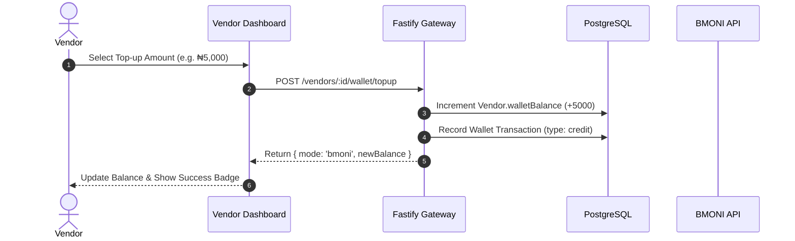

# BMONI Smart Wallet & Ledger Architecture

VendorMind uses BMONI for native on-chain cNGN smart wallet operations, prepaid credit billing, and vendor bank payouts.

---

## 🎯 Core Concepts

1. **Prepaid Credit System**:
   - Usage is billed per interaction:
     - Inbound message: `₦0.50`
     - Outbound message: `₦0.50`
     - AI processing (Groq / Claude): `₦25.00`
   - Balance is tracked on the `Vendor.walletBalance` field and verified prior to AI message execution.

2. **BMONI Embedded Smart Wallet**:
   - Each vendor account provisions an EVM-managed smart wallet via BMONI (`/v1/users/:userId/smart-wallets/create-managed`).
   - Customer payments settle in cNGN directly to the vendor's wallet without redirecting to external payment popups.

3. **Vendor Payouts & Offramp**:
   - Vendors can withdraw cNGN directly to any Nigerian bank account via BMONI NGN offramp APIs.

---

## 🔄 Top-Up Flow

---

## 🔒 Security & Fraud Prevention

- **Isolated Tenant Ledger**: Wallet balances are strictly bound to `vendorId` foreign keys.
- **Transaction Audit Log**: Every credit/debit creates an immutable transaction record with timestamp and description.
- **Zero Raw Secret Storage**: BMONI secret keys are never exposed on client-side JS. All wallet API interactions occur server-side through `BmoniService`.
