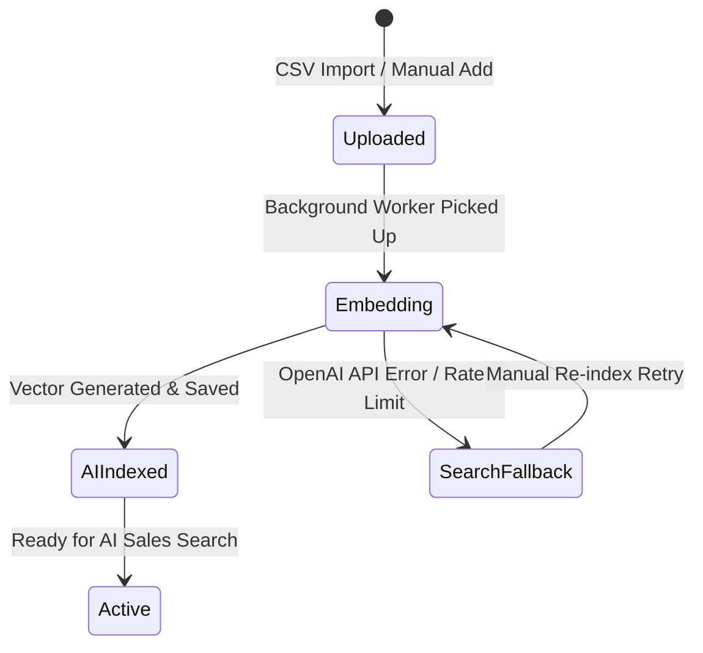

# Catalog Embedding & Ingestion Architecture

This document describes how vendor product catalogs (CSV, Excel, manual additions) are ingested, parsed, and embedded into PostgreSQL vector storage.

---

## 📥 Ingestion Pipeline

1. **Fuzzy Header Matcher**:
   - Supports any spreadsheet format (`Name`/`Product`, `Price`/`Cost`, `Description`/`Details`, `Stock`/`Quantity`).
   - Automatically cleans raw currency symbols (converts `₦2,500` to integer `2500`).

2. **Asynchronous Embedding Worker**:
   - Products are assigned `embedding: null` on insertion.
   - Background worker processes un-embedded products in batches.
   - Generates 1536-dimensional embeddings using OpenAI `text-embedding-3-small`.
   - Updates `Product.embedding` and sets status badge to `"AI indexed"`.

---

##  Catalog Indexing State Machine

---

##  Onboarding Gate

To ensure AI sales agent accuracy:
- The dashboard calculates catalog embedding coverage (`embeddedCount / totalCount`).
- Vendors must reach **>80% indexed products** before going live on WhatsApp.
