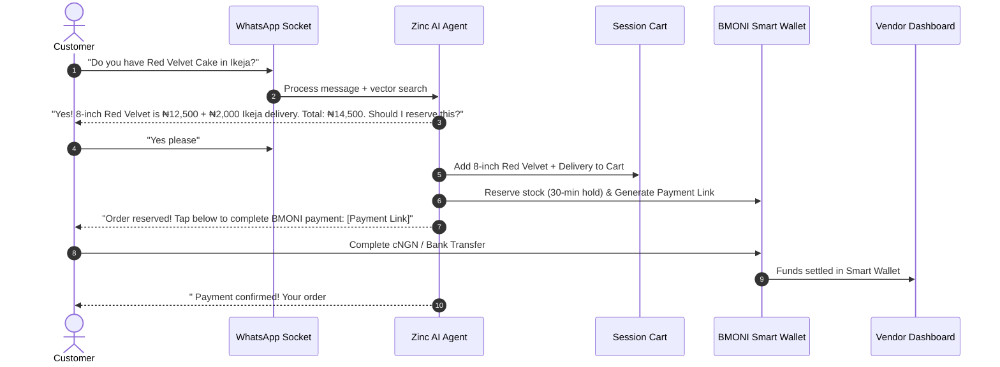

# Sales & In-Chat Checkout Flow Architecture

This document details the end-to-end sales conversation lifecycle, cart management, instant in-chat payment links, and order confirmation.

---

## 🛒 Sales Conversation Sequence

---

## ⏳ Stock Reservation & Expiry

- **Soft Hold**: Stock is temporarily held for **30 minutes** when a payment link is issued.
- **Auto Expiry**: If unpaid after 30 minutes, stock reservation is released back to available inventory.
- **Follow-up Reminder**: An automated reminder is sent after 15 minutes of inactivity.
