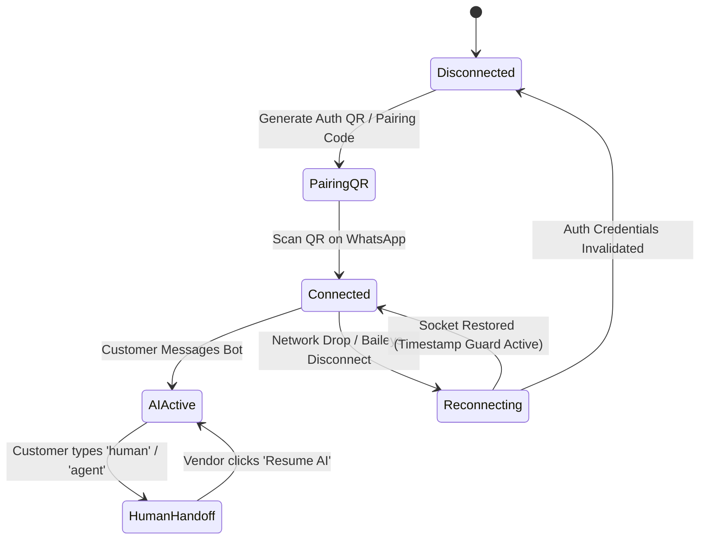

# WhatsApp Gateway & Fleet Manager Architecture

This document covers how VendorMind manages Baileys multi-device WhatsApp WebSocket connections across multiple vendors.

---

##  Multi-Tenant Architecture

VendorMind manages a fleet of isolated WhatsApp sockets using Baileys (`@whiskeysockets/baileys`).

- **Authentication Storage**: Baileys auth credentials (`baileys_auth_info`) are stored in isolated DB records per vendor.
- **QR & Pairing Code**: QR codes and 8-character phone pairing codes are served to the vendor dashboard in real-time via WebSocket/polling.
- **Reconnect Guard**: When socket reconnects, a timestamp guard ignores old unhandled WhatsApp notifications to prevent message floods.

---

## 🔄 Socket Lifecycle & Reconnect State Machine

---

## 🛑 Casual Chat & Group Filtering

To preserve credit balance and prevent spam:
1. **Group & Broadcast Filtering**: Group messages (`@g.us`) and status updates (`@broadcast`) are discarded immediately at socket level.
2. **Personal Chit-chat Classifier**: Non-commerce personal messages (e.g. *"Happy Sunday bro"*, *"How is the family?"*) trigger a stand-down classifier that steps aside without charging AI fees.
