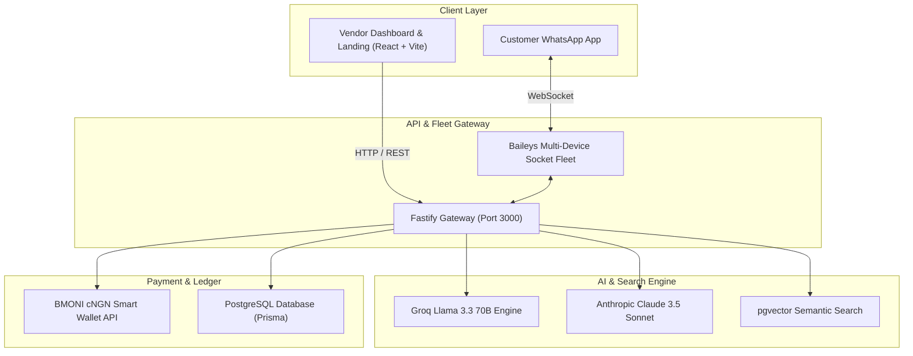
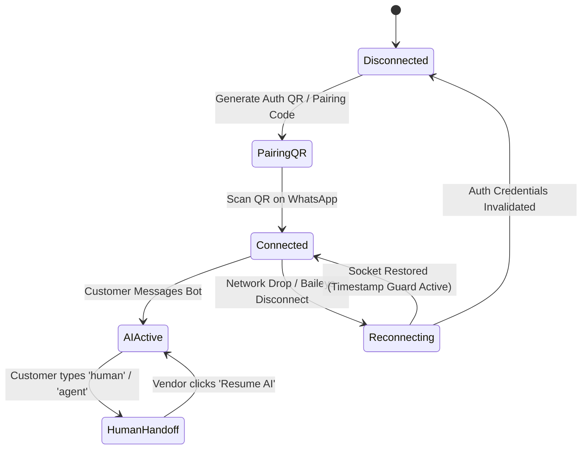
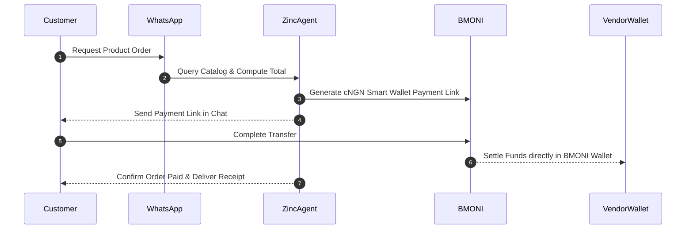

# System Architecture & Diagrams

Comprehensive Mermaid diagrams covering VendorMind's architecture, data flows, and state machines.

---

## 🏗️ C4 System Overview

---

## 🔄 WhatsApp Socket Connection State Machine

---

##  BMONI Order Settlement Flow

